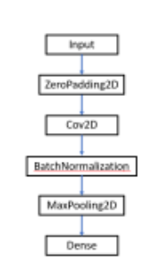

# CNN

Implemented a fully functioning CNN for classification in PyTorch.

## Tasks
- Use the CIFAR-10 dataset for all the experiments. Use a 70:30 data split.

- Compile the model by calling 
    - `model.compile(optimizer = "...", loss = "categorical
cross entropy metrics= ["accuracy"])`

- Train the model on train data by calling 
    - `model.fit(x = ..., y = ..., epochs= ...)`

    - Note that if you run `fit()` again, the model will continue to train with the parameters it has already learnt instead of reinitializing them.

- Test the model on test data by calling 
    - `model.evaluate(x = ..., y = ...)` 

- Show the model architecture using 
    - `model.summary()`

## The model architecture

1.  Use all three channels for the classification.
Use input shape (32 x 32 x 3).

2.  Use SGD optimizer with suitable learning rate, and suitable
activations in the required layers.

3. Try out all the following variations in the architecture of Given figure. Report the performance of all models.

    

    
    

    1.  No BatchNormalization
    2.  Two Dense Layers. (Note: The last Dense layer should have 10 nodes as there are 10 classes. For the Dense layer before that, use 64 nodes.)
    3. 2 blocks of Conv2D -> BatchNorm2D->MaxPooling2DFigure 1. CNN architecture
    4.  3 blocks of Conv2D -> BatchNorm2D->MaxPooling2D 

4. Add a table contrasting the performance of the given architecture with all above variations. 

5. State your analysis.

6. Save the best model and plot the accuracy vs epoch.